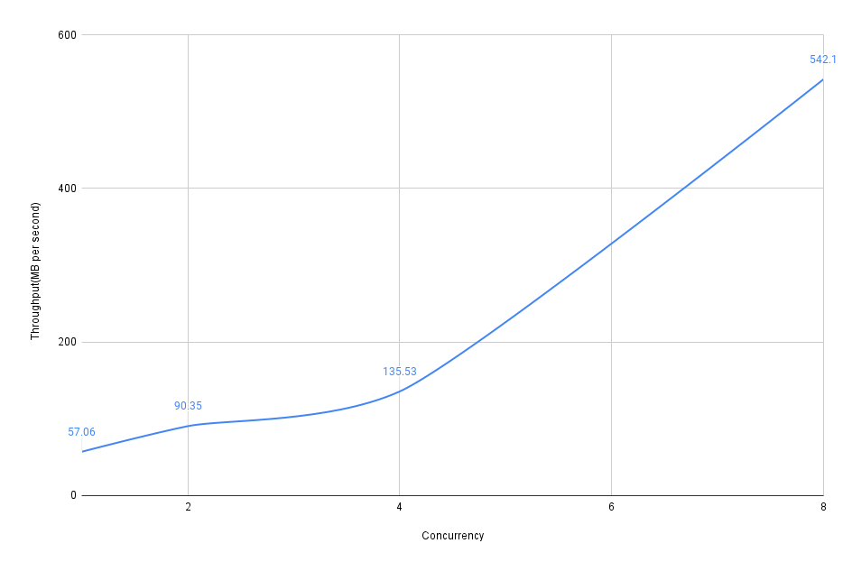

Concurrent File Transfer
-------------------------

This project aims to simulate concurrent file transfer through multiple connections.

### Prerequisites:
* Java 11
* Gradle 7.4

### How to run:
* To build the project *./gradlew clean build*
* Run server: *java -jar build/libs/server-1.0.jar*
* Run client: *java -jar build/libs/client-1.0.jar {{source_location}} {{concurrency}}*
  * {{source_location}} is required
  * {{concurrency}} is optional
* *Server* directory will be created as destination in the current location, where the command will be run.

### Chart
* 100 files of 10.8 MB was used for simulation
